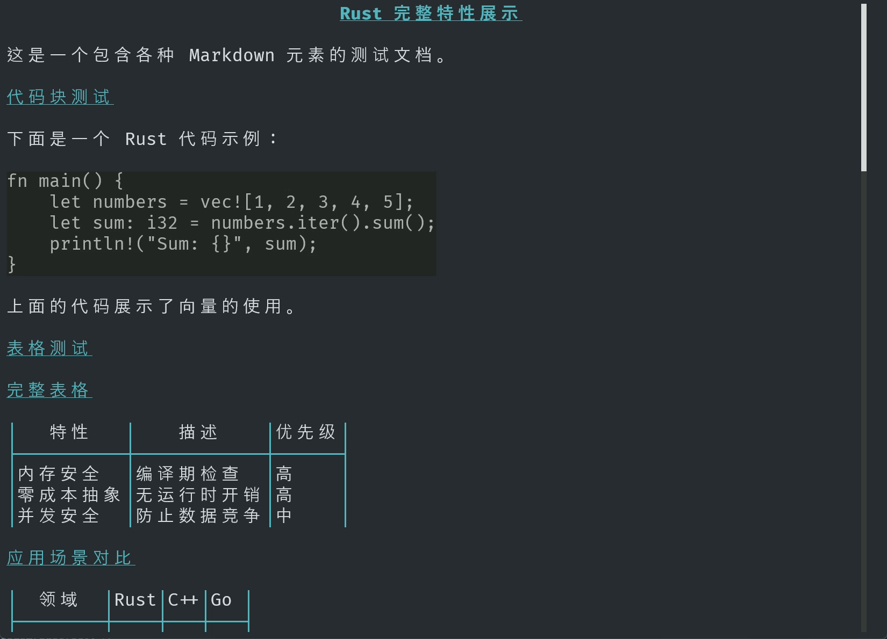

**[English](README.EN.md)** | **简体中文**

# Tai (态)

AI 驱动的命令行助手，支持流式输出、Markdown 渲染和多厂商模型。

Tai 是一个基于 Rust 的 CLI 工具，将对话式 AI 带到你的终端，具有：
- 精美的流式输出和推理过程可视化
- 原生 Markdown 渲染和语法高亮
- 自动对话历史记录管理
- 多厂商支持（OpenAI、DeepSeek 等）
- 快速高效，零活动循环


## 核心功能

### ⚡ 命令生成 (`tai go`)

自然语言转命令行：

```bash
tai go "列出所有 rust 文件"
# 生成并复制到剪贴板: ls **/*.rs
```


### 🤖 AI 对话 (`tai ask`)

在终端直接与 AI 模型对话，实时显示推理过程：

```bash
tai ask "解释 Rust 的所有权系统"
```


**特性：**
- **流式输出**：实时查看 AI 的回答生成过程
- **推理可视化**：灰色文本展示思考过程
- **Markdown 渲染**：表格、代码块等格式精美呈现
- **可滚动查看**：使用方向键浏览长回答
- **文件附加**：使用 `-f` 将文件作为上下文

### 📜 对话历史 (`tai ask -c`)

自动保存每次对话，随时回顾：

```bash
# 查看上一次对话
tai ask -c

# 浏览最近 10 条对话
tai ask -c 10
```

**特性：**
- 自动保存（最多 50 条最近记录）
- 方向键交互式选择
- 完整 Markdown 渲染
- 智能清理旧记录

### 🎛️ 模型管理 (`tai model`)

轻松在不同 AI 模型和厂商间切换：

```bash
# 交互式模型选择器
tai model

# 直接切换
tai model gpt-4o-mini
```


支持的厂商：
- **OpenAI**：GPT-4o, GPT-4o-mini
- **DeepSeek**：DeepSeek-Chat, DeepSeek-Reasoner
- 自定义厂商（通过 API 兼容性）

### 🔧 系统信息 (`tai init`)

收集系统信息供 AI 参考：

```bash
tai init
```

收集操作系统信息、环境详情，并保存到 `~/.tai/sysinfo.txt`。

## 安装

### 从源码编译

```bash
git clone https://github.com/yourusername/tai.git
cd tai
cargo build --release
```

可执行文件位于 `target/release/tai`。

### 系统要求

- Rust 1.93 或更高版本
- Windows 10+ / macOS / Linux
- 支持 ANSI 颜色的终端

## 配置

### 提供商设置

在 `~/.tai/providers.json` 中配置 API 凭证：

```json
[
  {
    "provider": "openai",
    "base_url": "https://api.openai.com/v1",
    "api_key": "sk-your-api-key-here",
    "model_names": ["gpt-4o-mini", "gpt-4o"]
  },
  {
    "provider": "deepseek",
    "base_url": "https://api.deepseek.com",
    "api_key": "sk-your-api-key-here",
    "model_names": ["deepseek-chat", "deepseek-reasoner"]
  }
]
```

### 活跃模型

当前模型存储在 `~/.tai/active_model.txt`，格式为 `provider/model_name`。

### 文件结构

```
~/.tai/
├── providers.json          # API 配置
├── active_model.txt        # 当前活跃模型
├── sysinfo.txt            # 系统信息
├── cache/
│   └── history/           # 对话历史
│       ├── 20260220_091234.md
│       └── ...
└── tai-*.log              # 滚动日志文件
```

## 使用示例

### 基本对话

```bash
tai ask "Rust 的优势是什么？"
```

响应会实时流式输出，推理过程显示为灰色，回答显示为白色。

### 带上下文的对话

```bash
tai ask -f Cargo.toml "分析这个项目的依赖"
```

将 `Cargo.toml` 作为上下文附加给 AI。

### 查看历史

```bash
# 上一次对话
tai ask -c

# 浏览最近的对话
tai ask -c 10
```

使用方向键导航，Enter 选择，`q` 退出。

### 查看渲染输出

流式输出完成后，按任意键进入可滚动查看器：



**控制键：**
- `↑/k` - 向上滚动
- `↓/j` - 向下滚动
- `PageUp` - 上一页
- `PageDown` - 下一页
- `q` - 退出查看器

## Markdown 渲染

Tai 使用两阶段渲染策略以获得最佳性能：

1. **流式阶段**：原始 markdown 输出，提供实时反馈
2. **完成阶段**：使用 `termimad` 在备用屏幕中美化渲染

### 支持的 Markdown

| 功能 | 支持 | 示例 |
|------|------|------|
| 标题 (H1-H6) | ✅ | `# 标题` |
| 代码块 | ✅ | ` ```rust\nfn main() {}\n``` ` |
| 行内代码 | ✅ | `` `代码` `` |
| 表格 | ✅ | `\| 列1 \| 列2 \|` |
| 列表 | ✅ | `- 项目` / `1. 项目` |
| 粗体/斜体 | ✅ | `**粗体**` / `*斜体*` |
| 删除线 | ✅ | `~~文本~~` |
| 引用 | ✅ | `> 引用` |
| 水平线 | ✅ | `---` |

## 架构

Tai 采用模块化的 Rust workspace 结构：

```
tai/
├── tai/                    # 主二进制程序
├── crates/
│   ├── tai-command/        # CLI 解析和处理器
│   ├── tai-ai/            # AI 客户端核心
│   ├── tai-tui/           # 终端 UI 组件
│   ├── tai-core/          # 共享工具
│   └── tai-pty/           # PTY 支持（开发中）
```

### 核心依赖

- [rig-core](https://github.com/0xPlaygrounds/rig) - AI 客户端框架
- [clap](https://github.com/clap-rs/clap) - 命令行解析
- [tokio](https://tokio.rs) - 异步运行时
- [crossterm](https://github.com/crossterm-rs/crossterm) - 终端控制
- [termimad](https://github.com/Canop/termimad) - Markdown 渲染
- [tracing](https://github.com/tokio-rs/tracing) - 日志系统

## 性能

- **零活动循环**：事件驱动架构，无轮询
- **流式处理**：响应实时生成，无需等待
- **智能缓冲**：高效的增量渲染
- **单例客户端**：AI 客户端初始化一次，重复使用
- **最小化分配**：谨慎的字符串处理和缓冲区重用

## 开发

### 构建

```bash
# 开发构建
cargo build

# 优化的 release 构建
cargo build --release

# 运行测试
cargo test
```

### 运行示例

```bash
# 测试模式（使用本地测试文件）
tai ask test

# 可滚动视图演示
cargo run --example scrollable
```

### 项目规范

- 每个文件最多 500 行（超过时提取到子模块）
- 使用 `tracing` 记录日志（文件为 debug，终端为 info）
- 优先代码复用而非重复（参见 `viewer.rs`）
- 错误处理：核心函数传播错误，辅助函数记录日志
- 详见 `.cursor/skills/tai-rust-best-practices/SKILL.md`

## 日志

日志写入 `~/.tai/tai-{timestamp}.log`，具有：
- 按小时滚动
- 最多保留 10 个文件
- 文件中为 debug 级别，终端为 info 级别

查看日志：

```bash
# Windows PowerShell
Get-Content ~\.tai\tai-*.log -Tail 50

# Unix
tail -f ~/.tai/tai-*.log
```

## 故障排除

### "No providers configured"（未配置提供商）

创建 `~/.tai/providers.json` 并添加 API 凭证（参见配置部分）。

### "Model not found"（未找到模型）

运行 `tai model` 查看可用模型并选择一个。

### 流式输出似乎很慢

检查网络连接。AI 提供商的响应时间因模型和负载而异。

### 颜色显示不正确

确保终端支持 ANSI 颜色。Windows 用户应使用 Windows Terminal 或 PowerShell 7+。

## 路线图

- [ ] 更多 AI 提供商（Anthropic、Google、Ollama）
- [ ] 历史记录搜索和过滤
- [ ] 导出对话为 markdown
- [ ] 通过 CLI 命令配置
- [ ] 自定义命令插件系统
- [ ] PTY 支持命令执行
- [ ] 跨平台路径处理

## 贡献

欢迎贡献！请随时提交 issue 或 pull request。

### 指南

1. 遵循项目的编码风格（参见 skills 文档）
2. 为新功能添加测试
3. 根据需要更新文档
4. 保持文件不超过 500 行
5. 使用有意义的提交消息

## 相关项目

- [termimad](https://github.com/Canop/termimad) - 我们使用的 Markdown 渲染引擎
- [rig](https://github.com/0xPlaygrounds/rig) - 驱动 Tai 的 AI 客户端框架

## 作者

由 V1hZ 用 ❤️ 创建

---

**注意**：这是 Tai 的早期版本。API 和功能可能会随着项目的发展而变化。非常欢迎反馈和贡献！
